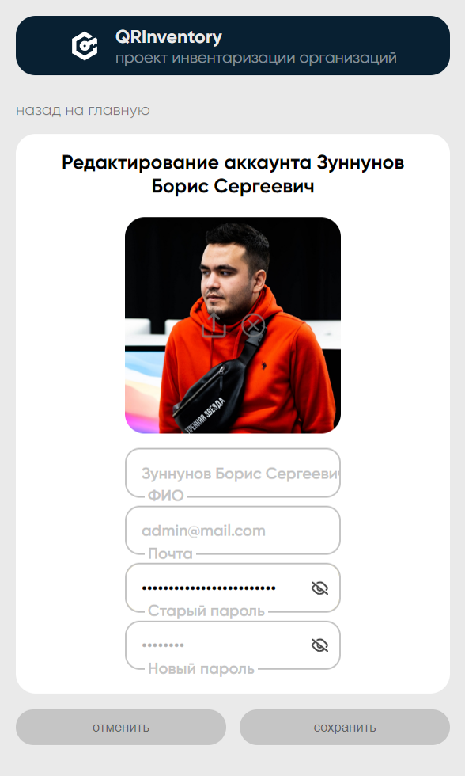
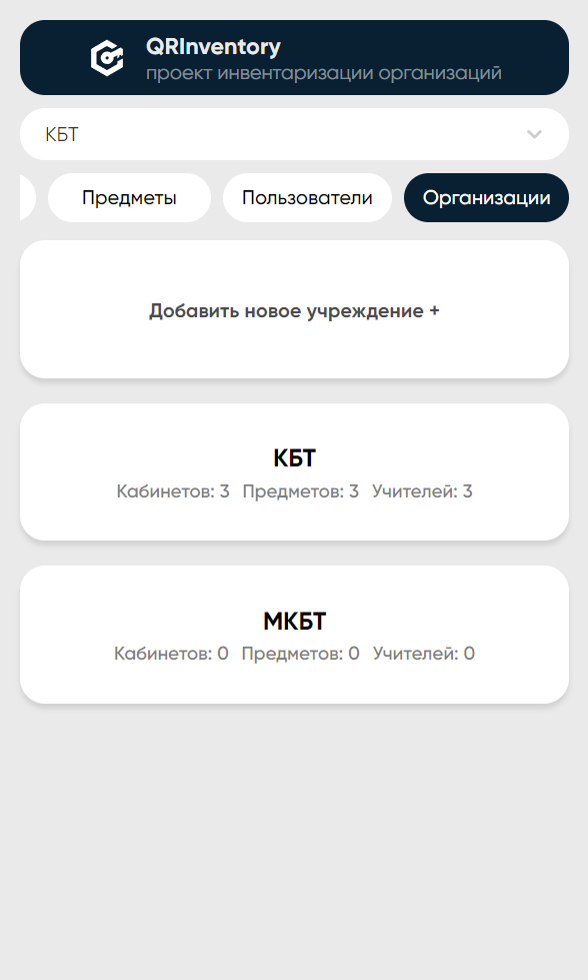
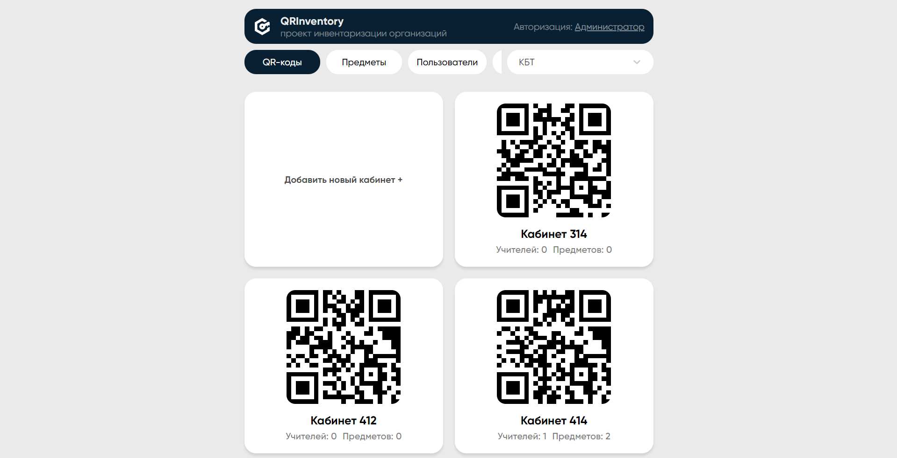
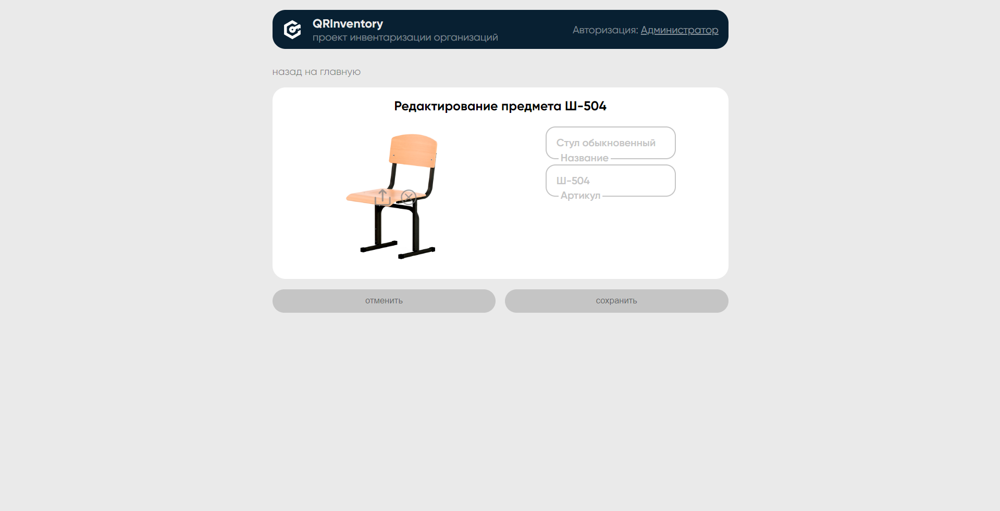

# **Фронтенд часть приложения инвентаризации колледжа**

[](https://github.com/0-MR-WIZARD-0/QRInventory/actions/workflows/actions.yml)

----------

<br/>

## **Способствие в разработке**: [nmgix](https://github.com/nmgix)
<br/>

----------

<br/>

## **Настройка**


 - `.env` файл

```md
    DOMAIN=qrinventory.ru
    REACT_APP_API_HOST=/
    GENERATE_SOURCEMAP=false
```

<br/>

----------

<br/>

## **Предпросмотр**

- ### Мобильная версия (редактирование профиля)
  
  <br/><br/>
- ### Мобильная версия (отображение организаций) 
  
  
  <br/><br/>
- ### Версия для пк (отображение кабинетов) 
  
  
  <br/><br/>
- ### Версия для пк (редактирование предмета) 
  
  

<br/>

----------


## **ChatGPT симфония о ReactJS и NestJS**

```
In the symphony of coding, two frameworks take the stage,
React and NestJS, a powerful duo engaged.

React, the front-end virtuoso, dances with grace,
Building user interfaces, at a rapid pace.
Components and states, creating a visual delight,
With JSX as the melody, everything feels right.

NestJS, the back-end maestro, orchestrates the show,
A framework for Node.js, bringing harmony to and fro.
Controllers and services, working hand in hand,
Creating APIs and servers, across the digital land.

Together they perform, a symphony of modern web,
React's virtual DOM and NestJS' RESTful ebb.
Client and server, communicating through requests,
Creating seamless experiences, that truly impress.

React's reactivity blends with NestJS' structure,
Front-end and back-end, unified without rupture.
State management and routing, smoothly intertwined,
As the symphony plays, their synergy aligned.

The symphony of React and NestJS, an exquisite display,
Building scalable applications, in an elegant array.
From UI interactions to server-side logic's might,
They harmonize and collaborate, shining so bright.

So let's applaud this symphony, a dynamic composition,
React and NestJS, a match made in coding fruition.
Together they create, pushing boundaries and beyond,
In the ever-evolving world of tech, they respond.
```